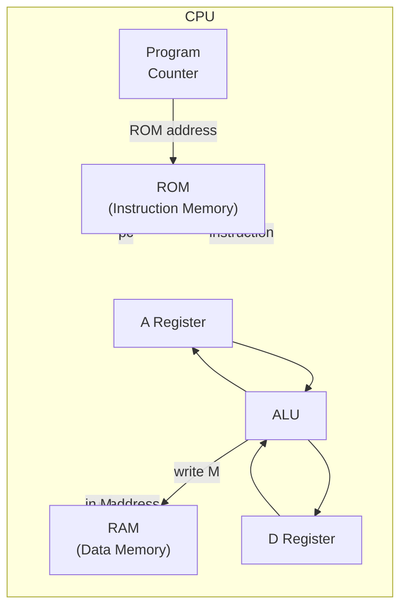

# KiKi-Pi-One

A 16-bit CPU designed and built from scratch  -  hardware in SystemVerilog, simulated in the browser.

[](https://github.com/SreejitS/KiKi-Pi-One/actions/workflows/test.yml)

> **Series:** [Medium](https://medium.com/@iamsreejits) · [sreejits.com](https://sreejits.com) · [Live Demo](https://kiki-pi-one.vercel.app)

---

## Architecture



---

## Article Series

| Part | Title | Code | Article | Demo |
|---|---|---|---|---|
| 0 | The ISA Specification | [00-spec/ISA.md](00-spec/ISA.md) | [Medium]() · [Blog]() |  -  |
| 1 | The Register | [01-registers/](01-registers/) | [Medium]() · [Blog]() | [Live Demo](https://kiki-pi-one.vercel.app/registers) |
| 2 | The ALU | [02-alu/](02-alu/) |  -  |  -  |
| 3 | Data Memory | [03-memory/](03-memory/) |  -  |  -  |
| 4 | Program Counter | [04-pc/](04-pc/) |  -  |  -  |
| 5 | The CPU | [05-cpu/](05-cpu/) |  -  |  -  |
| 6 | The Computer | [06-computer/](06-computer/) |  -  |  -  |
| 7 | The Assembler | [07-assembler/](07-assembler/) |  -  |  -  |

---

## Repository Structure

```
kiki-pi-one/
├── 00-spec/         ← ISA reference  -  the source of truth for everything
├── 01-registers/    ← Register (rtl/, tb/, README.md)
├── 02-alu/          ← ALU
├── 03-memory/       ← Data Memory
├── 04-pc/           ← Program Counter
├── 05-cpu/          ← CPU
├── 06-computer/     ← Top-level Computer
├── 07-assembler/    ← Python assembler
├── 08-web-demo/     ← Next.js interactive simulator
├── logisim/         ← Original Logisim Evolution circuit (preserved)
├── articles/        ← Markdown article drafts (published to Medium + WordPress)
└── tools/           ← publish.py  -  dual-publish articles
```

---

## Getting Started

### Running testbenches

```bash
# Install Icarus Verilog
brew install icarus-verilog        # macOS
sudo apt install iverilog          # Ubuntu/Debian

# Run the register testbench
iverilog -g2012 -o tb_register \
  01-registers/tb/tb_register.sv \
  01-registers/rtl/register.sv \
&& vvp tb_register
```

### Running the web demo locally

```bash
cd 08-web-demo
npm install
npm run dev
# Open http://localhost:3000
```

### Publishing articles

```bash
pip install python-frontmatter requests markdown python-dotenv
cp .env.example .env   # fill in your tokens
python tools/publish.py articles/00-isa-spec.md --target both --dry-run
python tools/publish.py articles/00-isa-spec.md --target both
```

---

## ISA at a Glance

Two instruction types:

```
A-instruction:  0 vvvvvvvvvvvvvvv   → A = 15-bit value
C-instruction:  111 a cccccc ddd jjj → compute / store / jump
```

Full specification: [00-spec/ISA.md](00-spec/ISA.md)

---

## Inspiration

- [Nand2Tetris](https://www.nand2tetris.org/)  -  the HACK architecture this is based on
- MIT 6.004 Computation Structures
- Logisim Evolution  -  used for the original visual prototype

## License

MIT  -  see [LICENSE.md](LICENSE.md)
